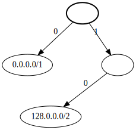
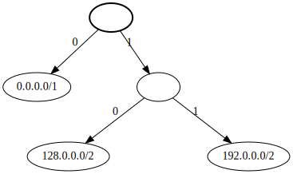
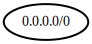
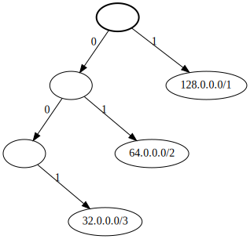

# cidr

Experimental library for storing and manipulating sets of [CIDR](https://en.wikipedia.org/wiki/Classless_Inter-Domain_Routing) format IP ranges.

## Usage

See [test_cidr.py](test_cidr.py) for more comprehensive usage via testing.

### Cidr Class

The Cidr class represents a single CIDR range.

```python
from cidr import Cidr

# Create a Cidr using the CIDR format
a = Cidr("0.0.0.0")
assert str(a) == "0.0.0.0/32"

b = Cidr("255.255.255.255/31")
assert str(b) == "255.255.255.254/31"

# Creat a Cidr using the specific ip and bitmask
c = Cidr(ip=511, bitmask=32)
assert str(c) == "0.0.1.255/32"
assert c.bit(1) == 0
assert c.bit(32) == 1
```

### CidrSet Class

The CidrSet class represents a set of CIDR ranges and supports set-like operations.

```python
from cidr import Cidr, CidrSet

# Create a new CidrSet
a = CidrSet(Cidr("0.0.0.0/1"))
assert len(a) == 1
assert Cidr("0.0.0.1/32") in a
assert Cidr("128.0.0.1/32") not in a

# Add to the set (collapses to higher range)
a.add(Cidr("128.0.0.0/1"))
assert len(a) == 1
assert str(list(a)[0]) == "0.0.0.0/0"

# Remove from the set (expands to lower ranges)
b = CidrSet(Cidr("0.0.0.0/2"), Cidr("255.255.255.255/2"))
c = a - b
assert [str(cidr) for cidr in c] == [
        "64.0.0.0/2",
        "128.0.0.0/2"
]
```

## Implementation

CidrSet is implemented as a binary [Trie](https://en.wikipedia.org/wiki/Trie) with the left edge implying a 0 bit and right edge a 1 bit. The depth of the node is equal to the bitmask value of the Cidr, with the root node having a depth of 0, and the edges representing a bit value of 0 or 1. A node represents a Cidr if and only if it is a leaf node. See Figure 1 for a CidrSet containing "0.0.0.0/1" and "128.0.0.0/2". The complete sub-tree to depth 32 is implied by each leaf node.

 Figure 1

If we add "192.0.0.0/2" to the set it could look like Figure 2.

 Figure 2

However, "128.0.0.0/2" and "192.0.0.0/2" in the set means that bit 1 has a value of 0 and bit 2 could be 0 or 1, as can all bits 3-32.  Therefore, those two nodes will collapse to "128.0.0.0/1".  But "0.0.0.0/1" and "128.0.0.0/1" in the set means that bit 1 can be 0 or 1, as can all bits 2-32.  So those two nodes can also collapse, to "0.0.0.0/0".

 Figure 3

In general if an add() operation results in a node with two leaf nodes as children the two children are deleted, with deletes cascading up the tree.  Similarly, if a remove() operation removes an implied descendant node, we will need to expand nodes to represent the remaining descendant nodes in the set.  If we remove "0.0.0.0/3" from "0.0.0.0/0" we are saying that the first 3 bits can't be "000" but they could still be "001", "01.", and "1..", resulting in the tree in Figure 4.

 Figure 4

## License

See the [LICENSE.txt](LICENSE.txt) file for license rights and limitations.
